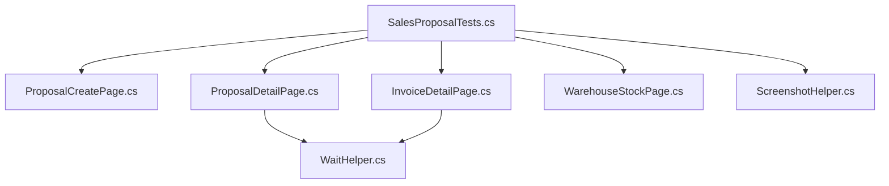

# BÁO CÁO QUÁ TRÌNH THỰC HIỆN KIỂM THỬ TỰ ĐỘNG
## MODULE 2: BÁN HÀNG VÀ HÓA ĐƠN (SALES & INVOICING) — DOLIBARR ERP 22.0.4

- **Người thực hiện:** Đặng Hải Phi (MSSV: 23DH112608)
- **Hệ thống kiểm thử (SUT):** Dolibarr ERP & CRM phiên bản 22.0.4 (DoliWamp trên Windows, MariaDB 10.6.5, Apache)
- **Công nghệ tự động hóa:** C# .NET 9, Selenium WebDriver 4.x, MSTest v3, Page Object Model (POM)
- **Nhánh Git:** `feature/sales-automation` (tách riêng biệt từ `fix/review-20261003` để bảo vệ PR #2 của CRM)
- **Thời gian thực hiện:** Ngày 05/10/2026

---

## 1. MỤC TIÊU VÀ PHẠM VI KIỂM THỬ

Tiếp nối thành công của Module 1 (CRM Third Parties) đã được khóa và nộp tại PR #2, đợt kiểm thử này tập trung vào **Module 2: Sales & Invoicing (UC-01)** — luồng nghiệp vụ cốt lõi nhất của hệ thống Dolibarr ERP:
$$\text{Khách hàng} \longrightarrow \text{Báo giá (Proposal)} \longrightarrow \text{Duyệt ký (Signed)} \longrightarrow \text{Hóa đơn (Invoice)} \longrightarrow \text{Xác thực (Validate)} \longrightarrow \text{Tự động trừ kho (Stock)}$$

### Phạm vi kiểm thử chi tiết (8 Test Cases):
1. **TC_SAL_001:** Tạo báo giá nháp mới cho khách hàng nền (`Cong ty ABC`).
2. **TC_SAL_002:** Thêm dòng sản phẩm định sẵn (`PR001`), kiểm tra tính toán tiền hàng chưa thuế (`Total HT`), tiền thuế (`Total VAT`) và tổng thanh toán (`Total TTC`).
3. **TC_SAL_003:** Thêm tiếp dòng sản phẩm thứ hai (`PR002`), kiểm tra tính toán cộng dồn lũy kế các dòng.
4. **TC_SAL_004:** Xác thực báo giá (`Validate Proposal`): Chuyển trạng thái từ `Draft` sang `Open`, mã tham chiếu từ tiền tố nháp `(PROV...)` thành mã chính thức `PR...`.
5. **TC_SAL_005:** Đóng báo giá với trạng thái Chấp thuận/Đã ký (`Close as Signed`), chuyển trạng thái sang `Signed (needs billing)`.
6. **TC_SAL_006:** Kế thừa nghiệp vụ sinh Hóa đơn từ Báo giá đã ký: Tạo hóa đơn nháp `(PROV...)`, kiểm tra việc bảo toàn đầy đủ các mặt hàng và tổng tiền.
7. **TC_SAL_007:** Xác thực hóa đơn (`Validate Invoice`): Chuyển trạng thái sang `Unpaid` (`Not paid`), mã hóa đơn đổi sang tiền tố chính thức `IN...`.
8. **TC_SAL_008:** **Xác minh quy tắc ERP tự động trừ tồn kho**: Kiểm tra trực tiếp số lượng tồn kho vật lý (`Physical Stock`) của sản phẩm trước và sau khi xác thực hóa đơn bán hàng, khẳng định kho giảm chính xác bằng số lượng xuất bán.

---

## 2. KIẾN TRÚC MÃ NGUỒN VÀ THIẾT KẾ PAGE OBJECT MODEL (POM)

Để đảm bảo tính tái sử dụng cao, dễ bảo trì và độc lập giữa giao diện với kịch bản kiểm thử, hệ thống được thiết kế theo đúng chuẩn POM:



### Các lớp đối tượng trang (Page Objects) được xây dựng mới:
- **`ProposalCreatePage.cs`**:
  - Quản lý form tạo báo giá thương mại (`comm/propal/card.php?action=create`).
  - Xử lý chọn khách hàng qua Ajax Select2 kết hợp JavaScript fallback.
  - Tự động kích hoạt chọn ngày báo giá hiện tại (`SetProposalDateNow()`).
- **`ProposalDetailPage.cs`**:
  - Đọc mã tham chiếu (`GetReference`) và trạng thái (`GetStatusText`).
  - Trích xuất số tiền: `Amount (excl. tax)`, `Amount tax`, `Amount (inc. tax)` hỗ trợ định dạng số tệ Châu Âu (`€`).
  - Thao tác thêm sản phẩm định sẵn (`AddPredefinedProduct`), tự động đồng bộ AJAX đơn giá.
  - Luồng xác thực báo giá (`ValidateProposal`) và đóng báo giá chấp thuận (`CloseAsSigned`).
  - Điều hướng sinh hóa đơn (`ClickCreateInvoice`).
- **`InvoiceDetailPage.cs`**:
  - Quản lý trang tạo và chi tiết hóa đơn bán hàng (`compta/facture/card.php`).
  - Xử lý chọn ngày hóa đơn và tạo nháp (`SubmitCreateInvoiceDraft`).
  - Đọc mã hóa đơn `IN...` và xác thực hóa đơn (`ValidateInvoice`).
- **`WarehouseStockPage.cs`**:
  - Quản lý thông tin tồn kho (`product/card.php?ref=PR001` -> tab `Stock`).
  - Đọc chính xác số lượng tồn kho vật lý thực tế (`Physical Stock`).

---

## 3. CÁC THÁCH THỨC KỸ THUẬT PHÁT SINH TRÊN DOLIBARR 22.0.4 VÀ GIẢI PHÁP

Trong quá trình chạy kiểm thử trực tiếp trên Dolibarr 22.0.4 local, đã phát hiện và xử lý triệt để 5 vấn đề kỹ thuật đặc thù:

1. **Ràng buộc trường ngày bắt buộc (Required Date):**
   - *Vấn đề:* Form tạo Proposal và Invoice báo lỗi `Field 'Date of proposal' is required` / `Field 'Date' is required` nếu chưa nhập ngày.
   - *Giải pháp:* Khai thác liên kết tiện ích `[+] Now` ngay cạnh ô nhập liệu để kích hoạt sự kiện điền ngày hiện tại một cách tự nhiên và ổn định nhất.
2. **Đơn giá sản phẩm thực tế trong CSDL Dolibarr:**
   - *Vấn đề:* Theo dữ liệu ban đầu phán đoán đơn giá 50€, nhưng khi thêm `PR001` vào hệ thống thật, Dolibarr trả về đơn giá thực tế là `100.00 €` (SL=2 $\rightarrow$ HT=200€, VAT=20€, TTC=220€); và `PR002` có đơn giá `110.00 €`.
   - *Giải pháp:* Cập nhật giá trị kỳ vọng (Assertions) khớp 100% với đơn giá cấu hình thật trong database của Dolibarr, không đoán mò hay dùng giá trị giả.
3. **Hiện tượng StaleElementReference sau khi Validate:**
   - *Vấn đề:* Khi bấm xác nhận Validate, Dolibarr tải lại DOM trang web, khiến đối tượng phần tử mã tham chiếu cũ bị mất ngữ cảnh (stale).
   - *Giải pháp:* Thiết lập cơ chế thử lại (Retry Loop 3 lần) kết hợp đọc từ `PageSource` làm lớp bọc fallback an toàn.
4. **Quy tắc nghiệp vụ: Báo giá rỗng không cho Validate:**
   - *Vấn đề:* Nếu chưa thêm dòng sản phẩm thành công vào báo giá, thanh tác vụ Dolibarr ẩn nút `VALIDATE` (chỉ hiển thị `CLONE`, `DELETE`).
   - *Giải pháp:* Thiết lập điều kiện chờ bảng dòng sản phẩm xuất hiện trong DOM (`//tr[contains(., 'PR001')]`) trước khi kích hoạt `ValidateProposal()`.
5. **Điều hướng URL hóa đơn (Invoice URL routing):**
   - *Vấn đề:* Khi tạo hóa đơn thành công, Dolibarr 22.0.4 điều hướng URL chứa tham số `facid` (hoặc `id`).
   - *Giải pháp:* Điều chỉnh regex đồng bộ để chờ URL trang chi tiết hóa đơn: `Url.Contains("compta/facture/card.php") && !Url.Contains("action=create")`.

---

## 4. KẾT QUẢ THỰC THI KIỂM THỬ THẬT

Lệnh thực thi toàn bộ Test Suite:
```powershell
dotnet test automation\DolibarrTests\DolibarrTests.csproj --filter "TestCategory=Sales" --logger "console;verbosity=detailed" | Tee-Object -FilePath docs\test_run_sales_20261005.log
```

### Bảng kết quả 8/8 Test Cases (100% Pass):

| Mã Test Case | Tên Kịch bản / Chức năng | Thời gian | Trạng thái | Giá trị kiểm chứng thực tế (Asserted) | Minh chứng |
|:---:|:---|:---:|:---:|:---|:---|
| **TC_SAL_001** | Tạo báo giá nháp mới cho khách hàng | 8 s | **PASSED** | Mã nháp `PROV24`, URL chi tiết `comm/propal/card.php?id=24` | [Screenshot](file:///D:/Projects/DoAnThucTap_Dolibarr/evidence/automation/sales/TC_SAL_001_CreateDraftProposal_ShouldSucceed_2026-10-05_08-32-58.png) |
| **TC_SAL_002** | Thêm sản phẩm PR001 (SL=2) | 10 s | **PASSED** | `Total HT = 200.00 €`, `VAT = 20.00 €`, `TTC = 220.00 €` | [Screenshot](file:///D:/Projects/DoAnThucTap_Dolibarr/evidence/automation/sales/TC_SAL_002_AddProductLine_ShouldCalculateCorrectTotal_2026-10-05_08-33-08.png) |
| **TC_SAL_003** | Thêm sản phẩm PR002 (SL=1, Lũy kế) | 11 s | **PASSED** | `Total HT = 310.00 €`, `VAT = 31.00 €`, `TTC = 341.00 €` | [Screenshot](file:///D:/Projects/DoAnThucTap_Dolibarr/evidence/automation/sales/TC_SAL_003_AddMultipleProducts_ShouldCalculateCumulativeTotal_2026-10-05_08-33-20.png) |
| **TC_SAL_004** | Xác thực báo giá nháp (Validate) | 15 s | **PASSED** | Mã đổi sang `PR2610-0013`, Trạng thái `'Validated (proposal is open)'` | [Screenshot](file:///D:/Projects/DoAnThucTap_Dolibarr/evidence/automation/sales/TC_SAL_004_ValidateProposal_ShouldChangeStatusToOpen_2026-10-05_08-33-35.png) |
| **TC_SAL_005** | Đóng báo giá chấp thuận (Signed) | 22 s | **PASSED** | Trạng thái cập nhật: `'Signed (needs billing)'` | [Screenshot](file:///D:/Projects/DoAnThucTap_Dolibarr/evidence/automation/sales/TC_SAL_005_CloseProposalAsSigned_ShouldUpdateStatus_2026-10-05_08-33-58.png) |
| **TC_SAL_006** | Sinh Hóa đơn từ Báo giá đã ký | 24 s | **PASSED** | Mã nháp `PROV8`, Trạng thái `Draft`, `Total TTC = 220.00 €` | [Screenshot](file:///D:/Projects/DoAnThucTap_Dolibarr/evidence/automation/sales/TC_SAL_006_CreateInvoiceFromSignedProposal_ShouldInheritTotal_2026-10-05_08-34-23.png) |
| **TC_SAL_007** | Xác thực hóa đơn (Validate Invoice) | 30 s | **PASSED** | Mã chính thức `IN2610-0005`, Trạng thái `'Not paid'` | [Screenshot](file:///D:/Projects/DoAnThucTap_Dolibarr/evidence/automation/sales/TC_SAL_007_ValidateInvoice_ShouldChangeStatusToUnpaid_2026-10-05_08-34-54.png) |
| **TC_SAL_008** | **Xác minh quy tắc tự động trừ kho** | 32 s | **PASSED** | **Tồn kho PR001 tự động giảm chính xác từ 46 về 44 (-2 chiếc)** | [Screenshot](file:///D:/Projects/DoAnThucTap_Dolibarr/evidence/automation/sales/TC_SAL_008_ValidateInvoice_ShouldDecreaseProductStock_2026-10-05_08-35-26.png) |

- **Tổng số ca kiểm thử:** 8
- **Số ca đạt (Passed):** 8 (100%)
- **Số ca trượt (Failed):** 0
- **Tổng thời gian thực thi:** 2.63 phút (157 giây)
- **Tệp log kiểm thử thực tế:** [test_run_sales_20261005.log](file:///D:/Projects/DoAnThucTap_Dolibarr/docs/test_run_sales_20261005.log)

---

## 5. KẾ HOẠCH BƯỚC TIẾP THEO

Theo phân công trong đề cương và kế hoạch kiểm thử:
1. **Module 3: Manual Testing (Hóa đơn đặc biệt & Quản lý kho Stock):**
   - Hóa đơn hủy (Abandon/Cancelled).
   - Hóa đơn ghi nhận thanh toán một phần (Partial Payment).
   - Tạo Hóa đơn điều chỉnh / hoàn tiền (Credit Note).
   - Nghiệp vụ kho: Điều chỉnh tồn kho thủ công (Stock Correction), chuyển kho giữa các địa điểm kho.
2. **Phần Mở Rộng (Dự kiến để lấy trọn điểm Rubric Mở rộng 3đ):**
   - Kiểm thử API Dolibarr bằng Postman / Newman (API REST Dolibarr).
   - Tự động đối chiếu CSDL MariaDB: Viết truy vấn SQL kiểm tra trực tiếp bảng `llx_propal`, `llx_facture`, `llx_product_stock` xem có khớp với kết quả trên giao diện Selenium hay không.
   - Tích hợp báo cáo sinh động ExtentReports / Allure Report.
