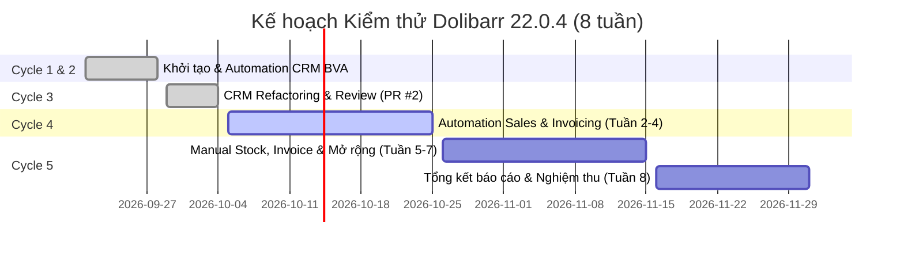

# KẾ HOẠCH KIỂM THỬ (TEST PLAN)
## Đồ Án Kiểm Thử Phần Mềm Dolibarr ERP & CRM 22.0.4

- **Người thực hiện:** Đặng Hải Phi (23DH112608)
- **Thời gian thực hiện:** Tháng 09/2026 – Tháng 12/2026
- **Tiêu chuẩn áp dụng:** IEEE 829 / Khung checklist T7C3 môn Đảm bảo chất lượng phần mềm
- **Hệ thống mục tiêu:** Dolibarr ERP & CRM phiên bản 22.0.4 (DoliWamp)

---

## 1. MỤC TIÊU VÀ PHẠM VI KIỂM THỬ (OBJECTIVES & SCOPE)

### 1.1 Mục tiêu
1. Đánh giá chất lượng, độ tin cậy và tính đúng đắn về mặt nghiệp vụ của phần mềm quản trị doanh nghiệp mã nguồn mở Dolibarr 22.0.4.
2. Xây dựng khung kiểm thử tự động (Automation Test Framework) vững chắc bằng C# .NET 9 theo mô hình Page Object Model (POM), có khả năng tự động đọc dữ liệu kiểm thử từ Excel và chụp ảnh minh chứng.
3. Kiểm thử tính toàn vẹn dữ liệu, các ràng buộc biên độ dài ký tự (BVA), khả năng xử lý chuỗi Unicode tiếng Việt đa byte, và cơ chế phòng chống tấn công XSS.
4. Xác minh sự liên thông dữ liệu xuyên suốt giữa các phân hệ: Bán hàng (Báo giá $\rightarrow$ Hóa đơn) và Quản lý Kho hàng (tự động giảm trừ tồn kho thực tế).

### 1.2 Phạm vi kiểm thử (In-Scope)
Kiểm thử tập trung vào **3 module trọng tâm** theo quy định đề tài:

| Module | Tên chức năng | Phân loại kiểm thử | Công cụ / Phương pháp |
|---|---|---|---|
| **CRM** | Quản lý Khách hàng (Third Parties) | **Automation (100%)** | Selenium WebDriver + MSTest + POM (C#) |
| **Sales** | Báo giá thương mại (Commercial Proposals) | **Automation (100%)** | Selenium WebDriver + MSTest + POM (C#) |
| **Invoicing** | Hóa đơn bán hàng chuẩn (Customer Invoices) | **Automation (100%)** | Selenium WebDriver + MSTest + POM (C#) |
| **Invoicing** | Hóa đơn đặc biệt (Hủy, Credit Note, Trả góp) | **Manual (100%)** | Kiểm thử thủ công, ghi log & chụp ảnh |
| **Stock** | Quản lý Tồn kho & Biến động kho | **Manual + Automation verify** | Kiểm thử thủ công kết hợp đối chiếu tự động |

### 1.3 Ngoài phạm vi kiểm thử (Out-of-Scope)
- Các module chưa kích hoạt: Sản xuất (Manufacturing), Kế toán kép (Double-entry accounting), Quản trị nhân sự (HRM), Điểm bán lẻ (POS).
- Kiểm thử hiệu năng chịu tải quy mô lớn (Load/Stress Testing > 10.000 người dùng đồng thời).
- Kiểm thử bảo mật chuyên sâu mã nguồn PHP (Penetration Testing mức độ mã nguồn gốc).

---

## 2. MÔI TRƯỜNG KIỂM THỬ (TEST ENVIRONMENT)

### 2.1 Môi trường hệ thống Dolibarr (SUT - System Under Test)
- **Phiên bản:** Dolibarr ERP & CRM 22.0.4 (gói cài đặt DoliWamp).
- **Hệ điều hành máy chủ:** Windows 11 64-bit (Localhost).
- **Web Server:** Apache 2.4.51 (`doliwampapache`).
- **Database:** MariaDB 10.6.5 (`doliwampmysqld`), cơ sở dữ liệu `dolibarr`.
- **Ngôn ngữ Backend:** PHP 8.x.
- **Base URL:** `http://localhost/dolibarr` (Trang đăng nhập: `http://localhost/dolibarr/index.php`).
- **Tài khoản quản trị kiểm thử:** `admin` (mật khẩu được lưu trong biến môi trường bảo mật `DOLIBARR_ADMIN_PASSWORD`).

### 2.2 Cấu hình nghiệp vụ quan trọng
- **Quy tắc trừ kho bắt buộc:** Bật cấu hình *"Decrease real stocks on validation of customer invoice/credit note"* (tại `Home` > `Setup` > `Modules` > `Stocks`). Quy tắc này là điều kiện tiên quyết để tồn kho tự động giảm khi hóa đơn được xác thực.
- **Dữ liệu nền mốc chuẩn (Clean Baseline Data):**
  - Khách hàng: `Cong ty ABC` (socid=1), `Cong ty BCD` (socid=2).
  - Sản phẩm & Tồn kho ban đầu tại kho `KHO001`:
    - `PR001`: Tồn 50 cái.
    - `PR002`: Tồn 30 cái.
    - `PR003`: Tồn 40 cái.
    - `PR004`: Tồn 89 cái.

### 2.3 Môi trường máy trạm thực thi Automation
- **Nền tảng:** .NET SDK 9.0.317.
- **IDE:** Visual Studio 2022 / Antigravity IDE / VS Code.
- **Trình duyệt thực thi:** Google Chrome (phiên bản ổn định mới nhất, chạy chế độ Incognito, phân giải màn hình chuẩn 1920x1080).
- **Thư viện NuGet:**
  - `Selenium.WebDriver` (4.x), `Selenium.Support`.
  - `MSTest.TestFramework`, `MSTest.TestAdapter`.
  - `EPPlus` (8.x) — hỗ trợ xử lý dữ liệu Excel tự động.
  - `Microsoft.Extensions.Configuration.Json`.

---

## 3. TIÊU CHÍ PASS / FAIL (PASS / FAIL CRITERIA)

### 3.1 Tiêu chí Pass cho Test Case
Một Test Case được ghi nhận là **PASS** khi thỏa mãn đồng thời:
1. Mọi bước thực hiện (Test steps) chạy thành công mà không gây crash trình duyệt hoặc treo tiến trình.
2. Không xuất hiện lỗi ngoại lệ nghiêm trọng của hệ thống: *Fatal error*, *Parse error*, *SQL syntax error*, hoặc mã phản hồi HTTP 500.
3. Tất cả các mệnh đề kiểm chứng (Assert Statements) trong code và bảng kết quả mong đợi đều đúng giá trị thực tế:
   - Tổng tiền trước thuế (Total HT), tiền thuế VAT, và tổng tiền thanh toán (Total TTC) khớp số học 100%.
   - Trạng thái chứng từ chuyển đổi chính xác (*Draft* $\rightarrow$ *Validated* $\rightarrow$ *Signed* $\rightarrow$ *Billed* / *Unpaid*).
   - Số lượng tồn kho thực tế sau khi bán hàng giảm chính xác: $\text{Tồn sau} = \text{Tồn trước} - \text{Số lượng bán}$.
   - Tên khách hàng tiếng Việt hiển thị toàn vẹn 100%, không bị lỗi font (mojibake).
   - Thẻ mã độc XSS `<Test>` bị loại bỏ khỏi HTML, không xuất hiện unescaped.

### 3.2 Tiêu chí Fail cho Test Case
Một Test Case bị đánh dấu là **FAIL** khi:
1. Có ít nhất một assertion không thỏa mãn (ví dụ: tổng tiền bị lệch, tên bị cắt sai độ dài, kết quả đếm `Count` không khớp).
2. Xảy ra ngoại lệ WebDriver: `NoSuchElementException`, `WebDriverTimeoutException` do giao diện phản hồi sai hoặc treo.
3. Xuất hiện cảnh báo bảo mật XSS (chuỗi injection được render nguyên vẹn thành HTML executable).
4. Quy tắc trừ kho không hoạt động: Số lượng tồn kho không suy giảm sau khi xác thực hóa đơn.

---

## 4. TIÊU CHÍ BẮT ĐẦU & KẾT THÚC (ENTRY & EXIT CRITERIA)

### 4.1 Tiêu chí bắt đầu kiểm thử (Entry Criteria)
1. Các dịch vụ hệ điều hành `doliwampmysqld` và `doliwampapache` ở trạng thái *Running*.
2. Cơ sở dữ liệu Dolibarr đã được phục hồi về bản dump mốc sạch ban đầu (chứa đầy đủ khách hàng mốc và sản phẩm mốc).
3. Tài liệu đặc tả Use Case (`docs/UseCases.md`) và ma trận test case trong Excel (`Dolibarr_TestCases.xlsx`) đã được phê duyệt.
4. Dự án C# Automation build thành công (`dotnet build` báo 0 Error, 0 Warning).

### 4.2 Tiêu chí kết thúc kiểm thử (Exit Criteria)
1. 100% các Test Case mức ưu tiên P1 (bắt buộc) của cả 3 phân hệ CRM, Sales & Invoicing, Stock đều đã được thực thi.
2. Tỷ lệ Pass của bộ kiểm thử hồi quy tự động đạt $\ge 95\%$.
3. Không còn lỗi mức độ nghiêm trọng (Blocker/Critical) hoặc lỗi bảo mật dữ liệu mở mà chưa được ghi nhận vào Bug Report.
4. Tất cả các ca kiểm thử đều có minh chứng rõ ràng: File log thực tế (`.log`) kèm ảnh chụp màn hình (`.png`) được tổ chức khoa học trong thư mục `evidence/`.
5. Bảng tổng hợp thực thi (Execution Summary) và ma trận truy vết (Traceability Matrix) trong Excel được đối chiếu đồng bộ với kết quả chạy thật.

---

## 5. QUẢN LÝ VÀ PHÒNG NGỪA RỦI RO (RISK MANAGEMENT)

| Mã Rủi ro | Mô tả Rủi ro | Mức độ | Biện pháp Phòng ngừa & Khắc phục |
|:---:|:---|:---:|:---|
| **R-01** | **Rủi ro xóa nhầm dữ liệu nghiệp vụ / DB nền** khi chạy script Cleanup | **Cao** | - Thiết lập Whitelist tiền tố nghiêm ngặt: chỉ xóa khách hàng bắt đầu bằng `AUTO_`, `SearchFull_`, ... - Chế độ **DRY-RUN mặc định (`CLEANUP_DRY_RUN=true`)**: chỉ quét và in danh sách, chỉ xóa khi có lệnh chủ động. - Đặt điều kiện bỏ qua ID đặc biệt (`socid=1, socid=2`, `Cong ty ABC`). |
| **R-02** | **Test Flaky do giao diện tải chậm / Ajax trễ** | **Trung bình** | - Tuyệt đối cấm sử dụng `Thread.Sleep`. - Toàn bộ cơ chế chờ đợi được chuẩn hóa qua `WaitHelper` dùng `WebDriverWait` với điều kiện hiển thị/tương tác cụ thể. - Tăng timeout linh hoạt (15–20s) cho các thao tác popup xác nhận. |
| **R-03** | **Lệch số liệu tồn kho giữa Automation và Manual** | **Cao** | - Tách biệt hoàn toàn bộ dữ liệu kiểm thử: Kịch bản Automation chỉ sử dụng các sản phẩm hoặc mã đơn hàng riêng biệt; Manual sử dụng các kịch bản riêng, không chạy đè lên nhau. |
| **R-04** | **Lỗi mã hóa tiếng Việt (Mojibake/Encoding)** khi chuyển tiếp dữ liệu qua CLI/Excel | **Thấp** | - Đồng bộ chuẩn UTF-8 toàn bộ mã nguồn C#, tệp Excel (qua EPPlus), và các script hỗ trợ. - Bổ sung assertion kiểm tra trực tiếp số lượng byte và ký tự non-ASCII (>127). |

---

## 6. LỊCH TRÌNH VÀ TIẾN ĐỘ THỰC HIỆN THEO CHU KỲ (EXECUTION STATUS BY CYCLE)

Kế hoạch kiểm thử được tổ chức theo 5 chu kỳ (Cycles), bám sát tiến độ 8 tuần đến hạn nộp đồ án:

### Bảng theo dõi thực thi theo chu kỳ (Execution Status By Cycle)

| Chu kỳ (Cycle) | Giai đoạn / Nội dung | Số TC | Passed | Failed | Blocked | Tỷ lệ Pass | Trạng thái |
|:---|:---|:---:|:---:|:---:|:---:|:---:|:---:|
| **Cycle 1** | Smoke Test & Khởi tạo khung Automation | 2 | 2 | 0 | 0 | 100% | **Hoàn thành** |
| **Cycle 2** | Kiểm thử CRM BVA (128/129 ký tự), Negative & Unicode | 7 | 7 | 0 | 0 | 100% | **Hoàn thành** |
| **Cycle 3** | CRM hoàn thiện: Update, Search, Delete & Review gia cố Cleanup | 5 | 5 | 0 | 0 | 100% | **Hoàn thành (Đang PR #2)** |
| **Cycle 4** | Automation Sales & Invoicing: Proposal $\rightarrow$ Invoice $\rightarrow$ Trừ kho | 10 (dự kiến) | 0 | 0 | 0 | 0% | *Sắp triển khai (Tuần 2–4)* |
| **Cycle 5** | Manual Testing: Hóa đơn đặc biệt, Quản lý kho & Phần mở rộng AI/Postman | 12 (dự kiến) | 0 | 0 | 0 | 0% | *Kế hoạch (Tuần 5–7)* |
| **TỔNG HỢP** | **Toàn bộ dự án** | **36** | **14** | **0** | **0** | **100% (hiện tại)** | **Đang tiến hành** |
