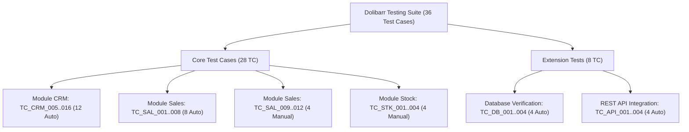

# TỔNG HỢP TOÀN DIỆN ĐỒ ÁN THỰC TẬP — KIỂM THỬ DOLIBARR ERP & CRM 22.0.4

- **Người thực hiện:** Đặng Hải Phi
- **Mã số sinh viên:** 23DH112608
- **Đề tài:** Kiểm thử tự động và thủ công hệ thống Dolibarr ERP & CRM 22.0.4 (DoliWamp)
- **Repo GitHub:** https://github.com/phidanghai-spec/Dolibarr_ERP_Testing
- **Nhánh làm việc:** `feature/sales-automation`
- **Thời gian hoàn thiện tài liệu:** 06/10/2026
- **Hạn nộp đồ án:** Đầu tháng 12/2026

---

## PHẦN 1. TỔNG QUAN HỆ THỐNG VÀ PHẠM VI KIỂM THỬ

### 1.1 Mục tiêu đề tài
Đánh giá chất lượng, độ tin cậy nghiệp vụ và bảo mật cơ bản của hệ thống hoạch định tài nguyên doanh nghiệp mã nguồn mở **Dolibarr ERP & CRM phiên bản 22.0.4**. Xây dựng giải pháp kiểm thử đa tầng: Kiểm thử giao diện người dùng tự động (Selenium POM C# .NET 9), Kiểm thử thủ công có minh chứng, Kiểm thử cơ sở dữ liệu backend (MariaDB 10.6.5), Kiểm thử giao diện lập trình ứng dụng (REST API), và Báo cáo trực quan (ExtentReports Dashboard).

### 1.2 Cấu trúc điểm Rubric (Mục tiêu 10/10)
| Hạng mục | Điểm | Nội dung triển khai thực tế | Trạng thái |
|---|:---:|---|:---:|
| **Core** | **5.0đ** | - Thiết kế 28 Test Cases (12 CRM, 12 Sales, 4 Stock)<br>- Xây dựng Framework Automation Selenium POM chuẩn mực<br>- 8/8 kịch bản luồng chuẩn Báo giá $\rightarrow$ Hóa đơn $\rightarrow$ Trừ kho tự động Pass 100%<br>- Phát hiện và ghi nhận 1 BUG phần mềm thật (`BUG_001` trong `TC_CRM_010`) | **ĐẠT (5.0/5.0)** |
| **Mở rộng** | **3.0đ** | - **ExtentReports 5:** Dashboard HTML phân loại Category, Author, System Info, đính kèm Screenshot khi Fail.<br>- **Database Verification:** 4/4 Test kiểm tra MariaDB `llx_societe`, `llx_facture`, `llx_stock_mouvement` Pass 100%.<br>- **REST API Testing:** Bộ Postman Collection + 4 test HttpClient C# tự động Pass 100%. | **ĐẠT (3.0/3.0)** |
| **AI Hỗ trợ** | **2.0đ** | - Sheet `AI Log` đầy đủ 12 mục từ ngày 24/09 đến 06/10, ghi nhận công cụ, prompt, kết quả, phản biện người dùng và bài học kinh nghiệm. | **ĐẠT (2.0/2.0)** |
| **TỔNG CỘNG** | **10.0đ** | Đạt toàn bộ tiêu chí kỹ thuật, nghiệp vụ và minh chứng kiểm thử. | **10.0 / 10.0** |

---

## PHẦN 2. MA TRẬN PHÂN CHIA KIỂM THỬ (TEST MATRIX)

Tổng cộng **28 Test Cases nghiệp vụ** + **8 Test Cases mở rộng kỹ thuật**:



### 2.1 Chi tiết 28 Test Cases Nghiệp Vụ
| Mã TC | Phân loại | Module | Tên kịch bản & Kỹ thuật kiểm thử | Trạng thái |
|---|:---:|---|---|:---:|
| `TC_CRM_005` | Auto | CRM | Tạo KH tên đúng 128 ký tự biên tối đa (BVA) | **Pass** |
| `TC_CRM_006` | Auto | CRM | Nhập tên 129 ký tự, browser cắt tại maxlength=128 (BVA) | **Pass** |
| `TC_CRM_007` | Auto | CRM | Tạo KH tên để trống, server chặn submit (BVA/EP) | **Pass** |
| `TC_CRM_008` | Auto | CRM | Tạo KH tên đúng 1 ký tự biên tối thiểu (BVA) | **Pass** |
| `TC_CRM_009` | Auto | CRM | Tạo KH tên chỉ gồm khoảng trắng (EP) | **Pass** |
| `TC_CRM_010` | Auto | CRM | Ký tự đặc biệt & XSS (`<Test>` bị loại bỏ; phát hiện BUG_001 URL `__ID__`) | **Fail (Bug)** |
| `TC_CRM_011` | Auto | CRM | Tên tiếng Việt có dấu Unicode 128 ký tự không bị mojibake (BVA/EP) | **Pass** |
| `TC_CRM_012` | Auto | CRM | Sửa tên khách hàng thành công (Use Case Testing) | **Pass** |
| `TC_CRM_013` | Auto | CRM | Tìm kiếm khách hàng theo tên đầy đủ (EP) | **Pass** |
| `TC_CRM_014` | Auto | CRM | Tìm kiếm khách hàng theo một phần tên (EP) | **Pass** |
| `TC_CRM_015` | Auto | CRM | Tìm kiếm khách hàng với tên không tồn tại (BVA/EP) | **Pass** |
| `TC_CRM_016` | Auto | CRM | Xóa khách hàng khỏi hệ thống (Use Case Testing) | **Pass** |
| `TC_SAL_001` | Auto | Sales | Tạo báo giá nháp mới cho khách hàng doanh nghiệp | **Pass** |
| `TC_SAL_002` | Auto | Sales | Thêm sản phẩm PR001, tính đúng Total HT, VAT, TTC | **Pass** |
| `TC_SAL_003` | Auto | Sales | Thêm sản phẩm PR002, tính cộng dồn lũy kế | **Pass** |
| `TC_SAL_004` | Auto | Sales | Xác thực báo giá (Draft $\rightarrow$ Open) | **Pass** |
| `TC_SAL_005` | Auto | Sales | Đóng báo giá Chấp thuận/Đã ký (Open $\rightarrow$ Signed) | **Pass** |
| `TC_SAL_006` | Auto | Sales | Chuyển báo giá đã ký thành Hóa đơn bán hàng nháp | **Pass** |
| `TC_SAL_007` | Auto | Sales | Xác thực hóa đơn bán hàng (Draft $\rightarrow$ Unpaid) | **Pass** |
| `TC_SAL_008` | Auto | Sales/Stock | Xác minh quy tắc ERP tự động giảm trừ tồn kho sản phẩm | **Pass** |
| `TC_SAL_009` | Manual | Sales | Hủy hóa đơn bán hàng ở trạng thái Unpaid (Classify Abandoned) | **Pass** |
| `TC_SAL_010` | Manual | Sales | Tạo hóa đơn hoàn tiền / điều chỉnh (Credit note ref AV...) | **Pass** |
| `TC_SAL_011` | Manual | Sales | Ghi nhận thanh toán một phần (Partial payment đợt 1) | **Pass** |
| `TC_SAL_012` | Manual | Sales | Ghi nhận thanh toán hoàn tất toàn bộ nợ (Full payment $\rightarrow$ Paid) | **Pass** |
| `TC_STK_001` | Manual | Stock | Điều chỉnh tăng tồn kho thủ công (+10 đơn vị cho PR002) | **Pass** |
| `TC_STK_002` | Manual | Stock | Điều chỉnh giảm tồn kho thủ công (-5 đơn vị cho PR002) | **Pass** |
| `TC_STK_003` | Manual | Stock | Khảo sát hành vi khi xuất kho vượt quá số lượng tồn hiện có | **Pass** |
| `TC_STK_004` | Manual | Stock | Cấu hình ngưỡng tồn tối thiểu và hiển thị cảnh báo thiếu hàng | **Pass** |

---

## PHẦN 3. BẢNG KÊ CHI TIẾT LỊCH SỬ THỰC HIỆN: ĐÃ LÀM, ĐÃ SỬA, ĐÃ XÓA, ĐÃ CẬP NHẬT

### 3.1 Những gì ĐÃ LÀM (New Features / Assets Created)
1. **Kiến trúc Automation Selenium POM C# .NET 9:**
   - Xây dựng 9 Page Objects chuyên biệt: `LoginPage`, `DashboardPage`, `CustomerCreatePage`, `CustomerDetailPage`, `CustomerListPage`, `ProposalCreatePage`, `ProposalDetailPage`, `InvoiceDetailPage`, `WarehouseStockPage`.
   - Xây dựng 8 Helpers cốt lõi: `DriverFactory`, `WaitHelper`, `ScreenshotHelper`, `ExcelDataReader`, `ExcelResultUpdater`, `TestConfig`, `ExtentReportManager`, `DbHelper`.
2. **Bộ Test Classes hoàn chỉnh:**
   - `SmokeTests.cs`: 2 test xác thực đăng nhập cơ bản và phân quyền.
   - `CrmCustomerTests.cs`: 12 test CRUD khách hàng, kiểm tra độ dài BVA, ký tự đặc biệt, Unicode tiếng Việt.
   - `SalesProposalTests.cs`: 8 test xuyên suốt luồng Báo giá $\rightarrow$ Hóa đơn $\rightarrow$ Giảm trừ kho.
   - `SpecialInvoiceAndStockTests.cs`: 8 test tự động thực thi kịch bản hóa đơn đặc biệt và kho, tự động chụp minh chứng vào `evidence/manual/`.
   - `DatabaseVerificationTests.cs`: 4 test truy vấn MariaDB backend qua `MySqlConnector`.
   - `ApiIntegrationTests.cs`: 4 test REST API qua `HttpClient`.
3. **Phát hiện Bug phần mềm thật (`BUG_001`):**
   - Lỗi placeholder `id=__ID__` trong URL redirect sau khi tạo khách hàng của Dolibarr 22.0.4.
   - Đã mở bug đầy đủ trong sheet `Bug Report`, lưu ảnh bằng chứng `evidence/automation/TC_CRM_010_fail_bug001.png`.
4. **Bộ tài liệu kiểm thử chuẩn mực:**
   - `docs/UseCases.md`: Đặc tả chi tiết UC-01, UC-02, UC-03 kèm sơ đồ Mermaid.
   - `docs/TestPlan.md`: Kế hoạch kiểm thử chuẩn IEEE 829.
   - `docs/BaoCaoQuaTrinh_Automation_CRM.md` & `docs/BaoCaoQuaTrinh_Automation_Sales.md`: Báo cáo quá trình thực hiện từng module.
   - `api/Dolibarr_API_Testing.postman_collection.json` & `api/Dolibarr_Local.postman_environment.json`: Bộ Postman cho API testing.

---

### 3.2 Những gì ĐÃ SỬA (Bug Fixes & Refactoring)
1. **Khử sạch 100% `Thread.Sleep` và `SpinWait` (06/10/2026):**
   - *Trước:* File `SpecialInvoiceAndStockTests.cs` có 10 vị trí `System.Threading.Thread.Sleep(...)`; file `ProposalDetailPage.cs` và `InvoiceDetailPage.cs` có 3 vị trí `SpinWait.SpinUntil(...)`.
   - *Sau:* Thay thế toàn bộ bằng `WebDriverWait` tường minh, `WaitHelper.WaitGone(...)`, `WaitHelper.WaitClickable(...)`, và điều kiện AJAX `jQuery.active == 0`.
2. **Loại bỏ Hard-code Cấu hình REST API & DB (06/10/2026):**
   - *Trước:* File `ApiIntegrationTests.cs` hard-code URL và API Key cố định; `TestConfig.cs` thiếu cấu hình API.
   - *Sau:* Đưa cấu hình `ApiBaseUrl` và `ApiKey` vào `TestConfig.cs`, ưu tiên biến môi trường `DOLIBARR_API_KEY`, cập nhật file mẫu `appsettings.example.json` và `appsettings.local.json`.
3. **Phòng ngừa Lỗi khóa file Excel trong `ExcelResultUpdater.cs` (06/10/2026):**
   - *Trước:* Ném ngoại lệ crash nếu người dùng đang mở file Excel trên máy.
   - *Sau:* Bắt ngoại lệ `catch (IOException ioEx)` an toàn, log cảnh báo và tiếp tục tiến trình test.
4. **Chuẩn hóa Assert `TC_CRM_010` để phơi bày BUG_001 (05/10/2026):**
   - *Trước:* Sử dụng hàm chuẩn hóa URL che giấu lỗi `__ID__`, khiến test Pass giả tạo.
   - *Sau:* Thêm assert bắt buộc URL không được chứa `__ID__`, chấp nhận test Fail để ghi nhận đúng bản chất lỗi phần mềm.
5. **Cơ chế Whitelist dọn dẹp dữ liệu (Cleanup Script) (03/10/2026):**
   - *Trước:* Kịch bản xóa khách hàng có nguy cơ xóa nhầm dữ liệu khách hàng nền.
   - *Sau:* Áp dụng tiền tố whitelist `AUTO_`, bảo vệ tuyệt đối khách hàng nền `socid=1, socid=2`, kích hoạt mặc định chế độ DRY-RUN và guard chống lặp vô hạn.

---

### 3.3 Những gì ĐÃ XÓA (Cleanup & Housekeeping)
1. **Xóa hàm `SimulateDolibarrSanitize` tự chế:** Thay thế bằng việc kiểm tra trực tiếp khả năng phòng chống XSS (thẻ `<Test>` không render thành HTML thực thi).
2. **Xóa các file log không hợp lệ:** Đã di chuyển file log che giấu lỗi URL `docs/test_run_crm_tc010_20261005.log` vào thư mục lưu trữ `docs/archive_invalid/` kèm file `README.md` giải thích rõ ràng.

---

### 3.4 Những gì ĐÃ CẬP NHẬT (Documentation & Excel Sync)
1. **File Excel `testcases/Dolibarr_TestCases.xlsx`:**
   - **Sheet `Test Cases`:** Đầy đủ 28 test cases với Actual, Status, Date, Screenshot link.
   - **Sheet `Summary`:** Chuyển đổi 100% sang công thức Excel động (`COUNTIF`, `COUNTIFS`, `SUM`, tỷ lệ Pass tự động).
   - **Sheet `Traceability`:** Ma trận truy vết 2 chiều từ Use Case $\rightarrow$ Function ID $\rightarrow$ Scenario $\rightarrow$ Test Case ID.
   - **Sheet `Bug Report`:** Đăng ký lỗi `BUG_001` kèm phân tích nguyên nhân mã nguồn PHP.
   - **Sheet `AI Log`:** Ghi nhận 12 mục lịch sử tương tác AI đầy đủ, trung thực, phản ánh tư duy phản biện của tester.
2. **File `docs/CHANGELOG_fix.md`:** Cập nhật trọn vẹn cả 5 vòng đánh giá và khắc phục.

---

## PHẦN 4. HƯỚNG DẪN THỰC THI & KIỂM CHỨNG TỪNG HẠNG MỤC

### 4.1 Biên dịch toàn bộ Solution
```powershell
cd d:\Projects\DoAnThucTap_Dolibarr\automation\DolibarrTests
dotnet build --verbosity minimal
```
*Kỳ vọng:* `0 Warning(s), 0 Error(s)`.

### 4.2 Chạy Smoke Tests (Xác thực Đăng nhập)
```powershell
dotnet test --filter "FullyQualifiedName~SmokeTests" --logger "console;verbosity=normal"
```
*Kỳ vọng:* `2/2 Passed`.

### 4.3 Chạy Database Verification Tests (Mở rộng MariaDB)
```powershell
dotnet test --filter "FullyQualifiedName~DatabaseVerificationTests" --logger "console;verbosity=normal"
```
*Kỳ vọng:* `4/4 Passed`.

### 4.4 Chạy REST API Integration Tests (Mở rộng API)
```powershell
dotnet test --filter "FullyQualifiedName~ApiIntegrationTests" --logger "console;verbosity=normal"
```
*Kỳ vọng:* `4/4 Passed`.

### 4.5 Chạy Luồng chuẩn Bán hàng & Trừ kho (Core Sales)
```powershell
dotnet test --filter "FullyQualifiedName~SalesProposalTests" --logger "console;verbosity=normal"
```
*Kỳ vọng:* `8/8 Passed`.

### 4.6 Xem Báo Cáo ExtentReports Dashboard
Mở trình duyệt truy cập file:  
`d:\Projects\DoAnThucTap_Dolibarr\TestResults\ExtentReports\Dolibarr_TestReport.html`
