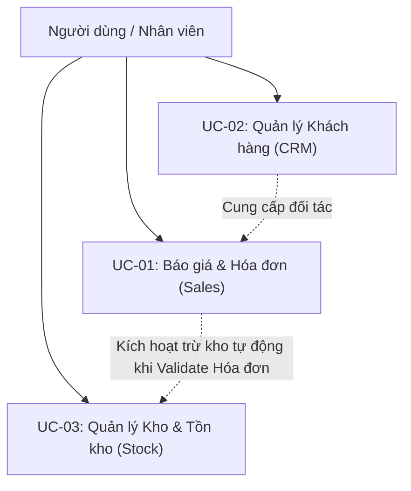

# TÀI LIỆU ĐẶC TẢ USE CASE (USE CASE SPECIFICATION)
## Đồ Án Kiểm Thử Hệ Thống Dolibarr ERP & CRM 22.0.4

- **Người thực hiện:** Đặng Hải Phi (23DH112608)
- **Hệ thống kiểm thử:** Dolibarr ERP & CRM phiên bản 22.0.4 (DoliWamp Local)
- **Phạm vi tài liệu:** Đặc tả 3 Use Case trọng tâm của đồ án:
  - **UC-01:** Luồng chuẩn Bán hàng & Hóa đơn (Sales Proposal to Customer Invoice)
  - **UC-02:** Quản lý Khách hàng / Đối tác (CRM - Third Parties Management)
  - **UC-03:** Quản lý Kho & Biến động Tồn kho (Stock & Warehouse Management)

---

## 1. TỔNG QUAN HỆ THỐNG USE CASE

| Mã UC | Tên Use Case | Module | Tác nhân chính | Mức ưu tiên | Phân loại kiểm thử |
|---|---|---|---|---|---|
| **UC-01** | Luồng chuẩn Báo giá → Hóa đơn | Sales & Invoicing | Nhân viên bán hàng, Kế toán | P1 (Core) | Automation |
| **UC-02** | Quản lý thông tin Khách hàng | CRM (Third Parties) | Nhân viên kinh doanh | P1 (Core) | Automation |
| **UC-03** | Quản lý & Cập nhật Tồn kho | Stock | Thủ kho, Quản lý kho | P1 (Core) | Manual & Verification |

---

## 2. CHI TIẾT CÁC USE CASE

### 2.1 USE CASE UC-01: LUỒNG CHUẨN BÁO GIÁ → HÓA ĐƠN (SALES PROPOSAL TO INVOICE)

#### 1. Mục tiêu
Mô tả quy trình nghiệp vụ xuyên suốt từ khi lập báo giá thương mại (Commercial Proposal), khách hàng chấp thuận ký duyệt, chuyển đổi tự động thành hóa đơn bán hàng (Customer Invoice), và xác nhận hóa đơn kích hoạt giảm trừ tồn kho trong hệ thống Dolibarr.

#### 2. Tác nhân (Actors)
- Nhân viên bán hàng (Sales Representative), Kế toán bán hàng (Billing Clerk).

#### 3. Tiền điều kiện (Preconditions)
- Khách hàng đã tồn tại trong hệ thống (dữ liệu nền: `Cong ty ABC` hoặc khách hàng sinh tự động).
- Sản phẩm có sẵn trong kho với số lượng tồn khả dụng (dữ liệu nền: `PR001` - tồn 50, `PR002` - tồn 30 tại kho `KHO001`).
- Module *Proposals*, *Invoices*, *Stocks* đã được kích hoạt.
- Rule cấu hình: *"Decrease real stocks on validation of customer invoice/credit note"* đã được bật trong Setup > Modules > Stock.

#### 4. Luồng sự kiện chính (Basic Flow)
1. **Tạo Báo giá nháp (Draft Proposal):**
   - Người dùng điều hướng: `Commerce` > `Commercial Proposals` > `New Proposal`.
   - Chọn khách hàng từ danh sách đối tác.
   - Nhập ngày báo giá, thời hạn hiệu lực, điều khoản thanh toán.
   - Nhấn **Create draft**. Hệ thống chuyển sang trạng thái *Draft* với mã tham chiếu tự sinh (`PR...`).
2. **Thêm sản phẩm vào Báo giá:**
   - Chọn sản phẩm từ danh mục (`PR001`), nhập số lượng (ví dụ: 2), đơn giá và mức thuế VAT (ví dụ: 10%).
   - Nhấn **Add**. Hệ thống tự động tính thành tiền trước thuế (Total HT), tiền thuế (VAT), và tổng cộng thanh toán (Total TTC).
3. **Duyệt Báo giá (Validate Proposal):**
   - Người dùng nhấn nút **Validate**.
   - Hộp thoại xác nhận hiển thị. Người dùng chọn xác nhận.
   - Hệ thống chuyển trạng thái báo giá từ *Draft* sang *Open (Validated)*.
4. **Ký duyệt Báo giá (Close Proposal as Signed):**
   - Khách hàng đồng ý mua hàng. Người dùng nhấn nút **Close (Set Accepted/Signed)**.
   - Chọn trạng thái *Signed* và xác nhận. Báo giá chuyển sang trạng thái sẵn sàng lập hóa đơn.
5. **Sinh Hóa đơn từ Báo giá (Create Invoice from Proposal):**
   - Tại trang chi tiết báo giá đã Signed, người dùng nhấn nút **Create invoice**.
   - Hệ thống tự động kế thừa toàn bộ thông tin đối tác và các dòng sản phẩm, đơn giá, chiết khấu sang giao diện lập hóa đơn.
   - Người dùng nhấn **Create draft**. Hóa đơn được tạo ở trạng thái *Draft* với mã tham chiếu tạm thời `(PROV...)`.
6. **Xác thực Hóa đơn (Validate Invoice):**
   - Người dùng kiểm tra tổng tiền và nhấn nút **Validate**.
   - Hộp thoại xác nhận hiển thị: cảnh báo hóa đơn sẽ được cấp mã chính thức (`IN...`) và kích hoạt trừ kho.
   - Người dùng xác nhận. Hóa đơn chuyển trạng thái sang *Unpaid (Chờ thanh toán)*.
   - Hệ thống tự động phát sinh bản ghi biến động kho: giảm trừ số lượng sản phẩm `PR001` tại kho `KHO001`.

#### 5. Luồng sự kiện thay thế (Alternative Flows)
- **A1 — Báo giá bị từ chối (Refused):** Ở bước 4, nếu khách hàng từ chối, chọn trạng thái *Refused*. Luồng kết thúc, không được phép sinh hóa đơn từ báo giá này.
- **A2 — Sửa đổi báo giá:** Khi ở trạng thái *Draft*, người dùng có thể thêm/bớt dòng sản phẩm, sửa đơn giá, số lượng. Hệ thống tự động cập nhật lại tổng tiền.

#### 6. Hậu điều kiện (Postconditions)
- Báo giá mang trạng thái *Billed (Đã lập hóa đơn)*.
- Hóa đơn mang trạng thái *Unpaid* với mã tham chiếu chính thức `IN...`.
- Tồn kho thực tế của các mặt hàng trong hóa đơn giảm chính xác bằng số lượng đã bán.

---

### 2.2 USE CASE UC-02: QUẢN LÝ THÔNG TIN KHÁCH HÀNG (CRM - THIRD PARTIES MANAGEMENT)

#### 1. Mục tiêu
Cung cấp chức năng quản lý toàn diện thông tin đối tác khách hàng (Third Parties / Société), đảm bảo tính toàn vẹn dữ liệu, kiểm soát độ dài, xử lý an toàn chuỗi đặc biệt (XSS), hỗ trợ đa ngôn ngữ Unicode (tiếng Việt có dấu), và kiểm soát thao tác xóa dữ liệu an toàn.

#### 2. Tác nhân (Actors)
- Nhân viên quản trị hệ thống (Admin), Nhân viên kinh doanh (Sales Representative).

#### 3. Tiền điều kiện (Preconditions)
- Người dùng đã đăng nhập thành công vào hệ thống Dolibarr với quyền quản lý Third Parties.

#### 4. Luồng sự kiện chính (Basic Flow)
1. **Tạo mới Khách hàng:**
   - Điều hướng: `Third Parties` > `New Third Party`.
   - Chọn loại đối tác: Khách hàng (*Customer* = checkbox `customerinput` được chọn).
   - Nhập tên khách hàng (*Third-party name*).
   - Nhấn **Save**. Hệ thống kiểm tra hợp lệ:
     - Tên rỗng hoặc chỉ chứa khoảng trắng: Bị chặn lại, thông báo lỗi *"Field 'Third-party name' is required"*.
     - Tên tối đa 128 ký tự (theo `llx_societe.nom` và thuộc tính `maxlength="128"`).
     - Browser tự động cắt ngắn chuỗi nhập nếu vượt quá 128 ký tự.
     - Ký tự HTML/XSS (ví dụ: `<Test>`): Dolibarr thực hiện sanitize phía server (`strip_tags`), loại bỏ thẻ nguy hiểm trước khi lưu vào DB.
     - Chuỗi Unicode tiếng Việt có dấu: Hệ thống lưu trữ và hiển thị toàn vẹn 100% không bị lỗi mã hóa (mojibake).
   - Form lưu thành công và tự động redirect về trang chi tiết khách hàng: `societe/card.php?socid={id}`.
2. **Cập nhật thông tin Khách hàng (Update Customer):**
   - Tại trang chi tiết khách hàng, nhấn nút **Modify (Sửa)**.
   - Hệ thống hiển thị form chỉnh sửa, các trường dữ liệu hiển thị giá trị hiện tại.
   - Người dùng thay đổi tên khách hàng và nhấn **Save**.
   - Hệ thống chuyển hướng về trang chi tiết và hiển thị tên mới đã cập nhật.
3. **Tìm kiếm Khách hàng (Search Customer):**
   - Điều hướng: `Third Parties` > `List of Customers`.
   - Nhập từ khóa vào ô tìm kiếm theo tên (`search_nom`).
   - Nhấn Enter hoặc nút tìm kiếm:
     - Tìm theo tên đầy đủ: Trả về chính xác 1 bản ghi khớp với tên đã tạo (`Count=1`).
     - Tìm theo một phần tên (substring): Trả về danh sách chứa từ khóa tìm kiếm (`Count >= 1`).
     - Tìm chuỗi không tồn tại: Trả về danh sách rỗng (`Count=0`) và hiển thị thông báo *"No record found"*.
4. **Xóa Khách hàng (Delete Customer):**
   - Tại trang chi tiết khách hàng, người dùng nhấn nút **Delete**.
   - Hộp thoại popup xác nhận jQuery UI (`#dialog-confirm-action-delete`) xuất hiện.
   - Người dùng nhấn nút **Yes** để xác nhận.
   - Hệ thống xóa bản ghi và điều hướng về trang danh sách. Tìm kiếm lại khách hàng vừa xóa xác nhận kết quả là 0 (`Count=0`).

#### 5. Hậu điều kiện (Postconditions)
- Dữ liệu khách hàng được ghi nhận chính xác trong bảng cơ sở dữ liệu `llx_societe`.
- Dữ liệu sau khi xóa không còn xuất hiện trong bất kỳ báo cáo hoặc danh sách hiển thị nào.

---

### 2.3 USE CASE UC-03: QUẢN LÝ KHO & BIẾN ĐỘNG TỒN KHO (STOCK MANAGEMENT)

#### 1. Mục tiêu
Quản lý số lượng tồn kho thực tế của sản phẩm tại từng kho hàng (`KHO001`), ghi nhận lịch sử các chuyển dịch kho (Stock movements), điều chỉnh tồn kho thủ công, và kiểm soát sự suy giảm tồn kho tự động phát sinh từ các giao dịch bán hàng.

#### 2. Tác nhân (Actors)
- Thủ kho (Warehouse Manager), Kế toán kho (Inventory Accountant).

#### 3. Tiền điều kiện (Preconditions)
- Module *Products* và *Stocks* đã được bật.
- Đã khai báo kho lưu trữ: `KHO001` (Kho chính).
- Dữ liệu mốc tồn kho ban đầu:
  - `PR001`: 50 đơn vị.
  - `PR002`: 30 đơn vị.
  - `PR003`: 40 đơn vị.
  - `PR004`: 89 đơn vị.

#### 4. Luồng sự kiện chính (Basic Flow)
1. **Tra cứu Tồn kho (Check Stock Level):**
   - Điều hướng: `Products` > `Warehouses` > Chọn kho `KHO001`.
   - Xem danh sách chi tiết các mặt hàng và số lượng tồn thực tế (*Real stock*) cùng giá trị tồn kho.
2. **Điều chỉnh Tồn kho thủ công (Stock Correction / Inventory Movement):**
   - Tại trang thông tin sản phẩm hoặc kho hàng, nhấn **Correct stock (Điều chỉnh kho)**.
   - Chọn loại thao tác: Tăng kho (*Add*) hoặc Giảm kho (*Remove*).
   - Nhập số lượng điều chỉnh (ví dụ: điều chỉnh giảm 5 đơn vị) và lý do điều chỉnh (*Inventory discrepancy / Hỏng hóc*).
   - Nhấn **Validate**.
   - Hệ thống cập nhật số tồn mới ngay lập tức và ghi một bản ghi lịch sử vào tab *Stock movements*.
3. **Biến động tồn kho tự động qua luồng Bán hàng (Automated Stock Decrease):**
   - Khi Hóa đơn bán hàng được xác thực (theo UC-01):
   - Hệ thống tự động tra cứu kho xuất hàng mặc định của sản phẩm (`KHO001`).
   - Tự động trừ số lượng sản phẩm: $\text{Tồn mới} = \text{Tồn cũ} - \text{Số lượng bán}$.
   - Ví dụ: Sản phẩm `PR003` có tồn ban đầu 40, bán 5 cái qua hóa đơn hợp lệ $\rightarrow$ tồn kho hiển thị cập nhật còn 35.
   - Trong lịch sử biến động kho (*Stock movements*), hệ thống tự sinh bản ghi có nhãn nguồn tham chiếu tới mã hóa đơn `IN...` tương ứng.
4. **Cảnh báo mức tồn tối thiểu (Stock Limit & Alert):**
   - Định cấu hình *Alert stock limit* (Mức cảnh báo tồn tối thiểu) cho sản phẩm (ví dụ: 10 đơn vị).
   - Khi tồn thực tế giảm xuống dưới ngưỡng cảnh báo, hệ thống hiển thị biểu tượng cảnh báo màu đỏ/vàng trên bảng điều khiển Dashboard và danh sách sản phẩm.

#### 5. Hậu điều kiện (Postconditions)
- Bảng cơ sở dữ liệu `llx_product_stock` và `llx_stock_mvt` ghi nhận chính xác số tồn và từng giao dịch chuyển dịch kho kèm thời gian, người thực hiện và mã chứng từ liên kết.
